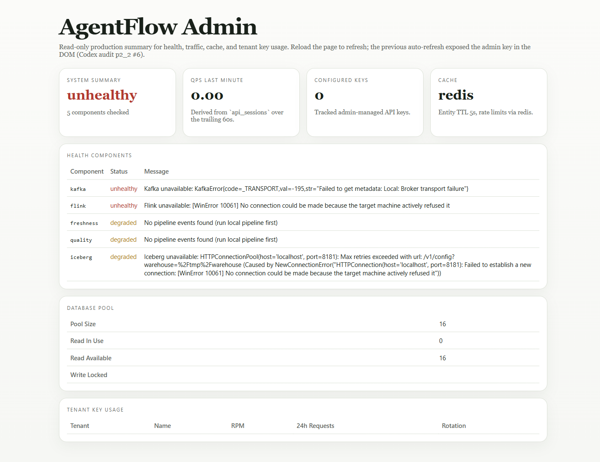
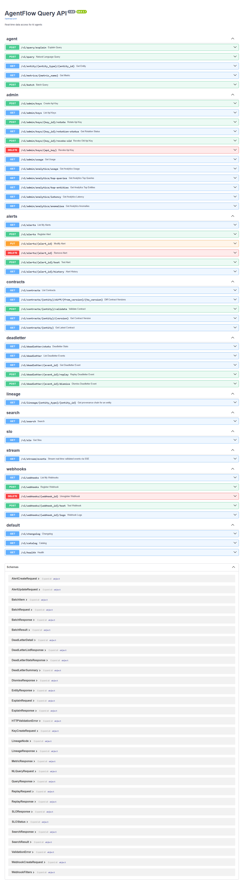
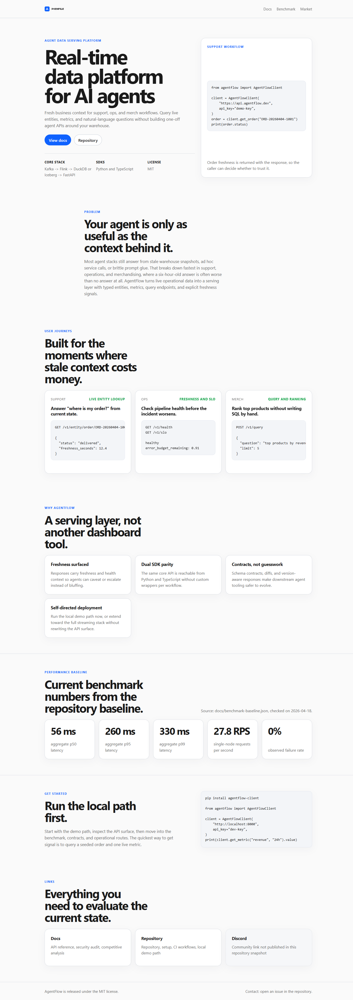
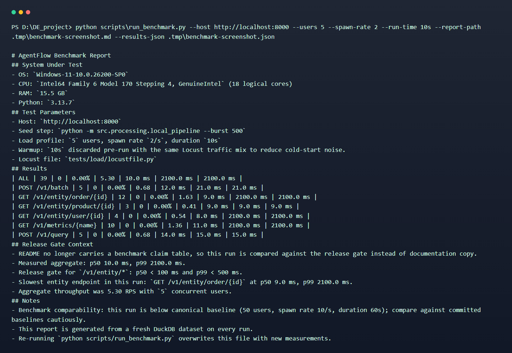

# AgentFlow

> Real-time data platform for AI agents. Live entity lookups, typed contracts, dual-language SDKs, and release-gated delivery.

[](docs/release-readiness.md)
[](https://codecov.io/gh/brownjuly2003-code/agentflow)
[](pyproject.toml)
[](LICENSE)

## Why this exists

Most agent demos work until they have to answer from live business state. Support, ops, and merch workflows need current orders, metrics, and health signals while the conversation is happening, not a stale warehouse snapshot and not a pile of one-off service adapters.

AgentFlow turns that problem into one serving boundary:

- streaming ingestion for operational events
- a semantic layer that exposes entities, metrics, and query endpoints
- typed contracts so SDKs and callers know what shape to expect
- Python and TypeScript clients that speak the same API surface

## Highlights

- **Release-line gate:** 749 passed, 4 skipped on 2026-05-02; GitHub environments `staging` and `production` have required reviewers. The 2026-04-27 audit closure sprint (Codex p1–p9 + Opus) shipped six commits closing all P0/P1/P2 findings — see [docs/audits/2026-04-27/README.md](docs/audits/2026-04-27/README.md) and Release Readiness for the live status
- **Sub-second entity lookups in the checked-in baseline**: entity p50 `38-55 ms`, entity p99 `290-320 ms`, aggregate p50 `56 ms` at `50` users for `60s`
- **Historical performance remediation is documented**: the serving path moved from an original ~`26,000 ms` baseline to the current `43-55 ms` release range
- **Dual SDK parity** for Python and TypeScript, including retry policies, circuit breakers, batching, pagination, and contract pinning
- **Postgres/MySQL CDC path** through Debezium and Kafka Connect, with local compose, Helm manifests, and canonical CDC normalization
- **Security hardening in the hot path**: parameterized queries, `sqlglot` AST validation for NL-to-SQL, and a Bandit baseline gate for new findings only
- **Release workflow coverage**: chaos smoke on PRs, performance regression gate, contract drift checks, and a Terraform apply workflow with OIDC-ready auth

## Quick start

> **Upgrading from v1.0.x?** See the [v1.1 migration guide](docs/migration/v1.1.md) before installing.

Prerequisites:

- Python `3.11+`
- `make`
- Docker Compose (`make demo` starts Redis)

PowerShell 7+:

```powershell
git clone https://github.com/brownjuly2003-code/agentflow.git
cd agentflow
. .\scripts\setup.ps1
make demo
```

macOS / Linux:

```bash
git clone https://github.com/brownjuly2003-code/agentflow.git
cd agentflow
source ./scripts/setup.sh
make demo
```

`make demo` seeds local data, starts Redis, and serves the API on `http://localhost:8000`. Swagger UI is available at `http://localhost:8000/docs`.

Try it:

```bash
curl http://localhost:8000/v1/entity/order/ORD-20260404-1001

curl -X POST http://localhost:8000/v1/query \
  -H "Content-Type: application/json" \
  -d '{"question":"Show me top 3 products"}'
```

Local demo runs without API-key enforcement unless you explicitly configure `AGENTFLOW_API_KEYS_FILE`.

## Architecture

```text
Event sources -> Kafka -> Flink -> Iceberg ----\
                                                -> Semantic layer -> FastAPI -> Agent / SDK
Local demo   -> local_pipeline -> DuckDB ------/
```

Stack:

- **Ingestion**: Kafka producers, Debezium/Kafka Connect CDC, and a local synthetic pipeline
- **Processing**: Flink plus validation and enrichment stages
- **Storage**: Iceberg for production-shaped tables, DuckDB for the local serving path
- **Serving**: FastAPI, contract registry, lineage, search, and operational endpoints
- **Orchestration**: Dagster
- **IaC**: Terraform, Helm, Docker Compose, and a Fly.io demo config

See [docs/architecture.md](docs/architecture.md) for the detailed design, trade-offs, and deployment topologies.

CDC source capture is standardized on Debezium/Kafka Connect; downstream consumers use the canonical AgentFlow CDC contract defined in [ADR 0005](docs/decisions/0005-cdc-ingestion-strategy.md).

## What's inside

| Area | Files |
|------|-------|
| API core | `src/serving/api/` |
| Semantic layer | `src/serving/semantic_layer/` |
| Python SDK | `sdk/agentflow/` |
| TypeScript SDK | `sdk-ts/src/` |
| Agent integrations | `integrations/agentflow_integrations/` (LangChain, LlamaIndex, CrewAI, MCP) |
| Flink jobs | `src/processing/flink_jobs/` |
| Test suites | `tests/` |
| Planning trail | `docs/plans/` |
| Public site | `site/` |
| IaC | `infrastructure/terraform/`, `helm/`, `k8s/` |

## Documentation

- [Architecture](docs/architecture.md) - system context, data flow, failure modes
- [Operational Runbook](docs/runbook.md) - local stack, CDC capture, incident response, and maintenance commands
- [API Reference](docs/api-reference.md) - endpoint-by-endpoint examples for curl, Python, and TypeScript
- [Security Audit](docs/security-audit.md) - threat model, controls, and evidence
- [Competitive Analysis](docs/competitive-analysis.md) - positioning and trade-offs
- [CDC Deployment Plan](docs/plans/2026-04-debezium-kafka-connect-deployment-plan.md) - Debezium/Kafka Connect rollout decisions and implementation trail
- [Glossary](docs/glossary.md) - interview-ready explanations of the core technical terms
- [Release Readiness](docs/release-readiness.md) - checked release evidence through `v1.1.0` and current CDC follow-up work
- [Audit History](docs/audit-history.md) - baseline-to-release remediation trail
- [Publication Checklist](docs/publication-checklist.md) - final GitHub publishing checklist
- [Fly.io Demo Deploy](deploy/fly/README.md) - minimal hosted demo instructions
- [Contributing](CONTRIBUTING.md) - development and PR expectations
- [Changelog](CHANGELOG.md) - project release notes

## Development

```bash
# verified release slice
python -m pytest tests/unit tests/integration tests/sdk -q

# benchmark and regression gate
python scripts/run_benchmark.py
python scripts/check_performance.py --baseline docs/benchmark-baseline.json --current .artifacts/load/results.json --max-regress 20

# benchmark trend: [.github/perf-history.json](.github/perf-history.json) is appended on every main push;
# render the history locally with `make perf-plot` (writes docs/perf/history.html).

# contracts and security
python scripts/generate_contracts.py --check
bandit -r src sdk --ini .bandit --severity-level medium -f json -o .tmp/bandit-current.json
python scripts/bandit_diff.py .bandit-baseline.json .tmp/bandit-current.json
```

## Status

**v1.1.0** is published to PyPI, npm, and GitHub.
The 2026-04-27 audit closure sprint landed six commits on `main`
that close all P0/P1/P2 findings from the Claude
Opus + Codex p1–p9 audits: tenant isolation across the control plane,
SQL guard centralization, entity allowlist enforcement on every read
surface, secrets scrubbed and rotated, helm `runAsNonRoot` /
NetworkPolicy / PodDisruptionBudget, npm lockfile + `npm audit` clean,
vulnerable dep bumps (`dagster>=1.13.1`, `langchain-core>=1.2.22`),
trivy pinned, OpenAPI drift gate, branch protection with 12 required
status checks, GitHub Actions environment reviewers, and Python SDK
alignment with the server v1 contract (F1–F10). Recent local full-suite
verification: `749 passed, 4 skipped` on 2026-05-02 after closing the
low-risk audit follow-ups. The post-v1.1 CDC operationalization
for Debezium / Kafka Connect is checked in, while production source
onboarding remains pending; see [docs/release-readiness.md](docs/release-readiness.md).
Remaining open items are AWS OIDC role setup for real Terraform apply,
production CDC source onboarding, public benchmark publication on
production hardware, final owner-auth `npm trust list` verification for npm
Trusted Publishing, and post-release PMF work.

## Screenshots

| Admin UI | API docs |
|----------|----------|
|  |  |

| Landing page | Benchmark run |
|--------------|---------------|
|  |  |

Capture notes and publish-time checks are listed in [docs/publication-checklist.md](docs/publication-checklist.md).

## License

MIT. See [LICENSE](LICENSE).

## Credits

Built as a data-engineering reference project during the `2026-04-10` -> `2026-04-20` release cycle, with the full implementation trail preserved in `docs/plans/`.
