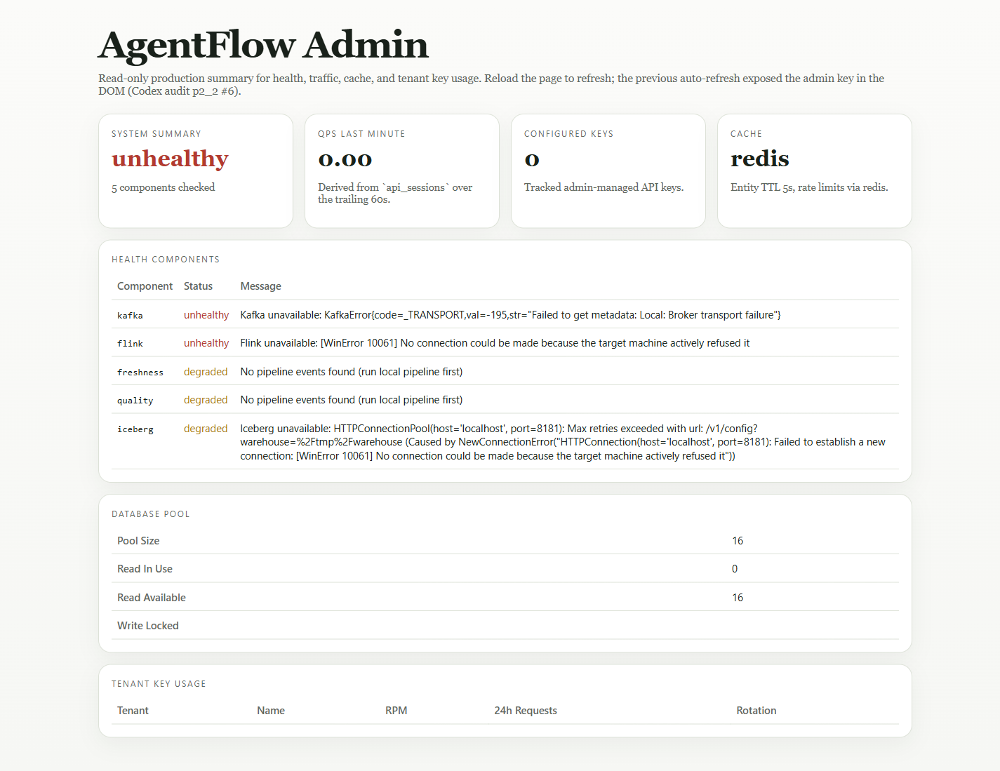
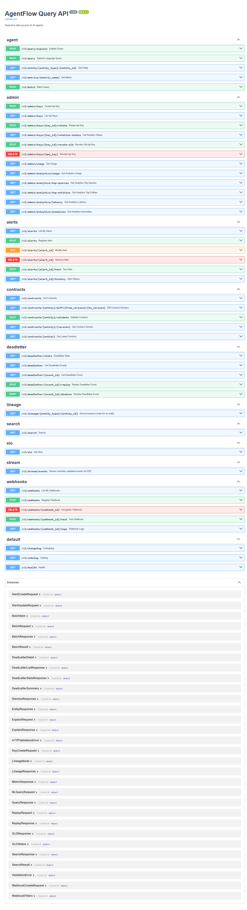
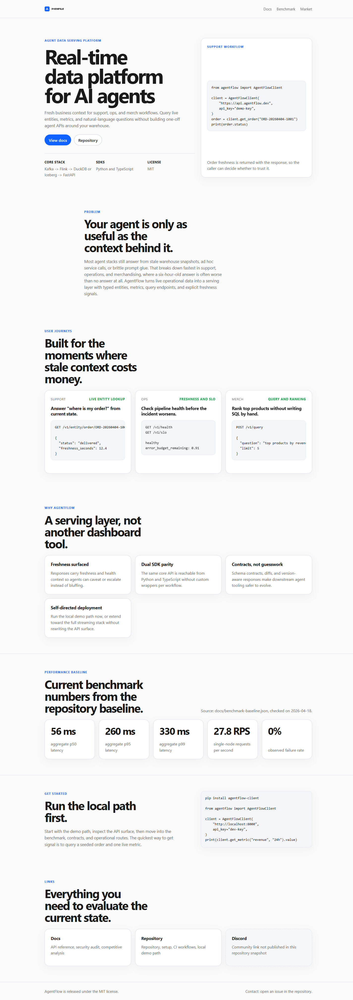
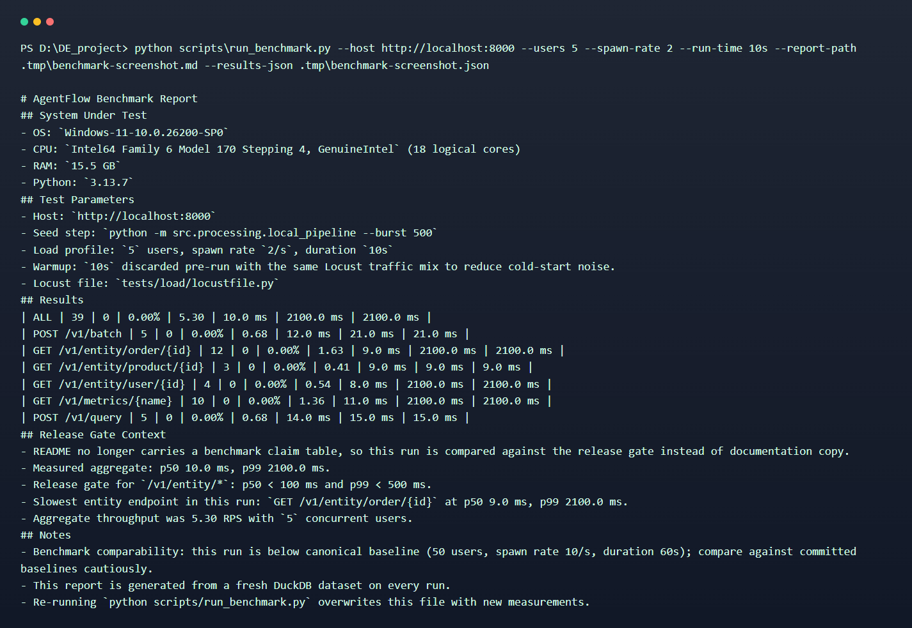

# AgentFlow

> Event-native metrics layer: business metrics that move when events happen — measured **3.0 s p50** event-to-metric on the real Kafka→Flink→bridge path, **1.1 s p50** on the in-process demo shortcut. Live entity lookups, typed contracts, dual-language SDKs, and release-gated delivery for people, dashboards, services, and AI agents alike.

[](docs/dv2-multi-branch/RELEASE_STATUS.md)
[](pyproject.toml)
[](LICENSE)

**Project status:** closure candidate. The engineering scope is feature-frozen;
the post-v2 golden topology remains a production candidate, not an accepted
production deployment. Final scope disposition and the remaining publication
gates are recorded in [docs/PROJECT_CLOSURE.md](docs/PROJECT_CLOSURE.md).

## Why this exists

BI on a replica answers yesterday's questions. Support, ops, and merch workflows need *current* orders, metrics, and health signals at the moment of decision — not a stale warehouse snapshot, not a pile of one-off service adapters, and not a cache that quietly serves 30-second-old numbers.

AgentFlow's axis is **event → live metric**: every metric declares which events move it (a contract-tested lineage graph), and the serving layer keeps reads fresh by invalidating its cache when events arrive — a measured behavior, not a slogan ([demo snapshot](docs/archive/performance/freshness-benchmark-2026-06-06.md), [real-path S8 snapshot](docs/archive/performance/freshness-e2e-realpath-2026-07-09.md)). One serving boundary on top of that axis:

- streaming ingestion for operational events (validated, enriched, journaled)
- a semantic layer that exposes entities, metrics, lineage, and query endpoints
- typed, versioned contracts — each metric ships with its source events and a staleness budget
- Python and TypeScript clients whose checked capabilities are published in the
  [machine-readable project claims](config/project_claims.toml)

Consumers are whoever needs the number now: humans, dashboards, downstream services, and AI agents — agents are one consumer, not the product.

## Highlights

- **Measured event-to-metric freshness** — two measured arms, not one number:
  - **Real path** (Kafka → Flink 2.3.0 → serving bridge → ClickHouse → `GET /v1/metrics/*` with Redis push invalidation): **3.02 s p50 / 5.70 s p95** (n=20, Mac/Colima) — [S8 e2e snapshot](docs/archive/performance/freshness-e2e-realpath-2026-07-09.md); current output ownership: [benchmark lifecycle](docs/perf/freshness-e2e-realpath.md), `python scripts/benchmark_freshness_e2e.py`
  - **In-process demo shortcut** (`local_pipeline` → DuckDB, no Kafka/Flink): **1.06 s p50 / 1.99 s p95**, tunable to **238 ms p50**; TTL-only ~15 s — [2026-06-06 demo snapshot](docs/archive/performance/freshness-benchmark-2026-06-06.md); current output ownership: [benchmark lifecycle](docs/perf/freshness-benchmark.md), `python scripts/benchmark_freshness.py`
  Do not present the 1.06 s figure as the production streaming path.
- **Measured write-path throughput** — bridge apply **87.4 events/s** on a 400-event burst (catch-up 4.6 s, peak lag 0) after three measured optimization steps (8 → 11.4 → 22.9 → 87.4), and a **4 h endurance soak** at the delivered ~47 eps with bounded lag, flat bridge RSS/FDs, one live fault replayed exactly-once, and zero cache drift — [q14 report](docs/perf/throughput-realpath-q14-2026-07-10.md), [S11 soak](docs/perf/soak-s11-2026-07-10.md)
- **At scale on its own data** — 4 years of the synthetic legend's history (**51.2 M rows, 2.87 M orders, 10.66 M Chestny Znak marking codes**) generated deterministically into the real raw-vault DDL; analyst queries answer in 20–730 ms and all 17 at-scale correctness checks pass — 10 row reconciliations, the 5 SQL-checkable generator-spec §12 invariants (channel and revenue mix, AOV bimodality, msk revenue share, GTIN validity), and 2 distribution checks, including a full-scan GS1 check-digit validation; the §12 spec's 12 invariants are pinned in full by 15 unit tests — [S13 report](docs/perf/scale-own-data-2026-07-11.md), `python scripts/benchmark_scale_own_data.py`
- **Lineage as a contract** — all six metrics declare their source events, serving table, and an **8 s p95** staleness budget in versioned contracts (the budget is the measured real-path p95 of 5.70 s plus headroom, and each contract carries that basis in writing), exposed through `/v1/catalog` and `/v1/contracts` and pinned by tests against the actual write path
- **Published release line through `v2.0.0`** on PyPI (`agentflow-runtime`, `agentflow-client`) and npm (`@yuliaedomskikh/agentflow-client`) via OIDC Trusted Publishers with SLSA provenance on every artifact
- **Tested and gated** — 1,500+ unit tests plus a broad Windows no-Docker suite; CI enforces 15 required status checks (lint, schema, unit, integration, helm, perf, terraform, bandit, safety, npm-audit, trivy, contract, build-smoke, sdk-ts, lock-check) through branch protection
- **Verified SDK parity** across Python and TypeScript — entity/metric historical
  reads, cursor/idempotent query, explain/search, contracts, lineage, changelog,
  health, catalog, batching, retries, and circuit breakers. TypeScript
  additionally provides event streaming and explicit `AbortSignal` cancellation.
  The generated [capability contract](docs/sdk-capabilities.md) is checked
  against both public client classes. Entity lookups remain sub-second (p50
  `38–55 ms`, p99 `167 ms` on local hardware).
- **Security in the hot path** — a tenant boundary that lives in each serving table's write key and is applied at a single read chokepoint ([ADR-004](docs/decisions/004-tenant-id-column-over-schema-per-tenant.md); proven against DuckDB and live ClickHouse 25.3 — see [STATUS](docs/STATUS.md#proven)), parameterized queries, `sqlglot` AST validation for NL-to-SQL, fail-closed auth, secret scrubbing, and a Bandit gate for new findings
- **Production-shaped extras** — two CDC paths (hardened Debezium/Kafka Connect + a ClickHouse per-branch fan-out), on-call [runbooks](docs/runbooks/README.md), and a [narrated demo](docs/dv2-multi-branch/) of the DV2 multi-branch warehouse

## Quick start

> **Upgrading from v1.0.x?** See the [v1.1 migration guide](docs/migration/v1.1.md) before installing.

Prerequisites:

- Python `3.11+`
- Docker Compose (optional, only for the ClickHouse-backed demo)
- `make` (optional, for the aliases below)

### No Docker (recommended first run)

PowerShell 7+:

```powershell
git clone https://github.com/brownjuly2003-code/agentflow.git
cd agentflow
. .\scripts\setup.ps1
python scripts/demo_local.py
```

macOS / Linux:

```bash
git clone https://github.com/brownjuly2003-code/agentflow.git
cd agentflow
source ./scripts/setup.sh
python scripts/demo_local.py
```

After package installation, this path stays local: it provisions a file-backed
DuckDB database, processes 500 synthetic events without the optional Iceberg
sink, disables external Kafka/Flink/Redis health probes, and serves the API on
`http://localhost:8000`. Swagger UI is available at
`http://localhost:8000/docs`. `make demo-local` is an alias for the same
command.

### Docker demo

Use `make demo` when you specifically want Redis and the ClickHouse serving
store:

```bash
make demo
```

This path requires Docker Compose and mirrors validated pipeline events into
ClickHouse.

Try it:

```bash
curl http://localhost:8000/v1/entity/order/ORD-20260404-1001

curl -X POST http://localhost:8000/v1/query \
  -H "Content-Type: application/json" \
  -d '{"question":"Show me top 3 products"}'
```

Local demo runs without API-key enforcement unless you explicitly configure `AGENTFLOW_API_KEYS_FILE`.

### Use your own local API key

Open demo mode is for exploration. To exercise real API-key auth locally:

```bash
cp .env.example .env
python scripts/rotate_keys.py --name Local --tenant default
```

PowerShell uses `Copy-Item .env.example .env`; the key-generation command is
the same.

The plaintext API key is **shown once**; the script stores only a **one-way hash**
in ignored `config/api_keys.local.yaml` (the hash scheme follows
`config/security.yaml` and is not hard-coded by the script).

The tracked `config/api_keys.yaml` remains a sample and is not modified by this
local flow.

Start the API with the keys file and **without** `AGENTFLOW_AUTH_DISABLED`.

macOS/Linux:

```bash
SERVING_BACKEND=duckdb AGENTFLOW_LOCAL_ONLY=true \
  AGENTFLOW_API_KEYS_FILE=config/api_keys.local.yaml DUCKDB_PATH=agentflow_demo.duckdb \
  python -m uvicorn agentflow_runtime.serving.api.main:app --host 0.0.0.0 --port 8000
```

PowerShell 5.1+:

```powershell
$env:SERVING_BACKEND = "duckdb"
$env:AGENTFLOW_LOCAL_ONLY = "true"
$env:AGENTFLOW_API_KEYS_FILE = "config/api_keys.local.yaml"
$env:DUCKDB_PATH = "agentflow_demo.duckdb"
python -m uvicorn agentflow_runtime.serving.api.main:app --host 0.0.0.0 --port 8000
```

Then send the plaintext key shown by `rotate_keys.py`:

```bash
curl -H "X-API-Key: <plaintext-from-rotate_keys>" \
  http://localhost:8000/v1/entity/order/ORD-20260404-1001
```

Warning: the Hugging Face Space `demo-key` is **public-demo-only**. Do not reuse
it as a local or production secret.

## Architecture

```text
Event sources -> Kafka -> PyFlink -> events.validated -+-> Iceberg materializer
                                                       +-> bridge -> ClickHouse -\
Local demo   -> local_pipeline -------------------------------> ClickHouse ----+-> FastAPI -> Agent / SDK
                                                (DuckDB: local-dev / test compatibility)
```

The containerized PyFlink 2.3 topology is a production candidate, not a
production-acceptance claim. The verified boundaries now include the streaming
path Kafka → PyFlink → `events.validated` → bridge → ClickHouse → API, a clean
Operator/Helm acceptance scaffold, direct live Iceberg materialization,
checkpoint restore/replay, and digest-only staging promotion. Production
rollout is not implemented or authorized; current gates and exact evidence live
in [docs/STATUS.md](docs/STATUS.md).

Stack:

- **Ingestion**: Kafka producers, Debezium/Kafka Connect CDC, and a local synthetic pipeline
- **Processing**: Flink plus validation and enrichment stages
- **Storage**: Iceberg for production-shaped tables; **ClickHouse is the serving store** (ADR 0006 — ReplacingMergeTree upserts, `final=1` reads), DuckDB the local-dev / test store
- **Serving**: FastAPI, contract registry, lineage, search, and operational endpoints
- **Orchestration**: Dagster
- **IaC**: Terraform, Helm, Docker Compose, and a Fly.io demo config

See [docs/architecture.md](docs/architecture.md) for the detailed design, trade-offs, and deployment topologies.

CDC source capture is standardized on Debezium/Kafka Connect; downstream consumers use the canonical AgentFlow CDC contract defined in [ADR 0005](docs/decisions/0005-cdc-ingestion-strategy.md).

## What's inside

| Area | Files |
|------|-------|
| API core | `src/agentflow_runtime/serving/api/` |
| Semantic layer | `src/agentflow_runtime/serving/semantic_layer/` |
| Python SDK | `sdk/agentflow/` |
| TypeScript SDK | `sdk-ts/src/` |
| Agent integrations | `integrations/agentflow_integrations/` (LangChain, LlamaIndex, CrewAI, MCP) |
| Flink jobs | `src/agentflow_runtime/processing/flink_jobs/` |
| Test suites | `tests/` |
| Design decisions | `docs/decisions/` (ADRs) |
| Public site | `site/` |
| IaC | `infrastructure/terraform/`, `infrastructure/dv2/`, `helm/`, `k8s/` |
| DV2.0 warehouse | `warehouse/agentflow/dv2/` (hubs / links / satellites + real-dataset loader) |

## Documentation

Use the [documentation hub](docs/README.md) as the map for the complete corpus.
The shortest paths are:

- learn: [Quickstart](docs/quickstart.md) → [Architecture walkthrough](docs/architecture/index.md) → [API](docs/api/index.md) or [SDKs](docs/sdk.md);
- verify current truth: [Engineering status](docs/STATUS.md), [machine-readable claims](config/project_claims.toml), and [project closure](docs/PROJECT_CLOSURE.md);
- operate: [Operational runbook](docs/runbook.md), [on-call runbooks](docs/runbooks/README.md), and [troubleshooting](docs/troubleshooting.md);
- review design/evidence: [architecture reference](docs/architecture.md), [ADRs](docs/decisions/), [performance evidence](docs/perf/), and [immutable evidence index](docs/evidence/INDEX.md).

The [interactive walkthrough](docs/index.md) is the curated MkDocs site.
Historical or superseded narrative is preserved under
[`docs/archive/`](docs/archive/) rather than deleted.

## Development

```bash
# verified release slice
python -m pytest tests/unit tests/integration tests/sdk -q

# broad Windows no-Docker suite (audit F-07): sequential per-process shards
# with a per-shard peak-memory budget under the host's 1 GiB process guard.
# Do not run the monolithic pytest command above for this purpose on Windows.
python scripts/run_windows_unit_shards.py tests/unit

# benchmark and regression gate
python scripts/run_benchmark.py
python scripts/check_performance.py --baseline docs/benchmark-baseline.json --current .artifacts/benchmark/current.json --max-regress 20

# benchmark trend: [.github/perf-history.json](.github/perf-history.json) is appended on every main push;
# render the history locally with `make perf-plot` (writes docs/perf/history.html).

# contracts and security
python scripts/generate_contracts.py --check
bandit -r src sdk --ini .bandit --severity-level medium -f json -o .tmp/bandit-current.json
python scripts/bandit_diff.py .bandit-baseline.json .tmp/bandit-current.json
```

## Status

**`v2.0.0` is the current release line** — PyPI `agentflow-runtime` /
`agentflow-client` and npm `@yuliaedomskikh/agentflow-client`, all
published via OIDC Trusted Publishers with SLSA provenance attestations.
`main` carries 15 required status checks; their live state is authoritative
at [the checks page](https://github.com/brownjuly2003-code/agentflow/actions)
— this README makes no standing claim about it. The living
engineering status — what is proven, what is in progress, what is next —
is tracked in [docs/STATUS.md](docs/STATUS.md).

The registries remain on published line `v2.0.0`; `main` is prepared for the
unpublished lockstep `v2.1.0` release and is intentionally ahead of that tag.
The former long-form README narrative for `v1.1.0` through `v2.0.0` is
[preserved in the documentation archive](docs/archive/release-history-v1-v2.md);
the [changelog](CHANGELOG.md) remains the complete release source.

The latest bounded delivery evidence is F-19 staging digest promotion plus its
offline production-promotion verifier. Production deployment remains
`BLOCKED_EXTERNAL_PRODUCTION_TARGET_CONTRACT`, and `production.status` remains
`candidate`; see [engineering status](docs/STATUS.md).

### Scope

This is a reference data-engineering project. Component, contract, Helm, and
replay tests exercise the checked-in streaming, lake, serving, and deployment
artifacts; they do not constitute a clean-cluster golden-topology acceptance.
Wiring it to a live production source needs inputs that live outside the repo —
CDC source onboarding (runbook ready in
[docs/operations/cdc-production-onboarding.md](docs/operations/cdc-production-onboarding.md)),
a public benchmark on production-grade hardware, and an external pen-test
attestation.

## Screenshots

| Admin UI | API docs |
|----------|----------|
|  |  |

| Landing page | Benchmark run |
|--------------|---------------|
|  |  |

Capture notes and publish-time checks are listed in
[docs/operations/publication-checklist.md](docs/operations/publication-checklist.md).

## License

MIT. See [LICENSE](LICENSE).

## Credits

Built as a data-engineering reference project. Initial release cycle
`2026-04-10` → `2026-04-20`, followed by post-audit hardening, the DV2
extension, and the published `v2.0.0` line. Architecture decisions are
recorded as ADRs in [docs/decisions/](docs/decisions/); the complete release
timeline is in the [changelog](CHANGELOG.md).
