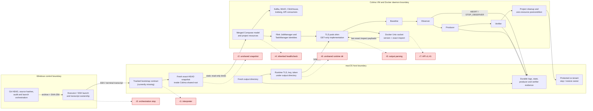

# CI-soak r1-r7 architecture audit

- **Audit date:** 2026-08-20
- **Audited baseline:** `b151a1f98d0151bc3e84cfa93618fc85d7b78f64`
- **Latest implementation baseline:** `c798e716e4de5721ed9e8cbf37747a66c3dd4689`
- **Scope:** static, local, documentation-only audit
- **Current verdict:** `ARCHITECTURE_READY=BLOCKED`
- **Blocking findings:** `A-03` through `A-09`
- **Completed local slices:** L1 / `A-01`, L2 / `A-02` (2026-08-20)

## 1. Purpose, evidence rules, and verdict

This audit traces the capacity-independent Compose rehearsal from the Windows
workspace through launch, macOS/Colima, the runtime controller, workload gates,
cleanup, and restoration. It covers the seven unsuccessful `r1`-`r7` attempts
without changing code or runtime state.

The intended audience is the developer or operator preparing local remediation
before asking for another external rehearsal.

### Evidence vocabulary

| Tag | Meaning |
| --- | --- |
| `RUNTIME-PROVEN` | Durable attempt evidence or a bounded replay demonstrated the cause or behavior. |
| `CODE-PROVEN` | The behavior follows directly from tracked code at the audited baseline. |
| `CLOSED-LOCAL` | A correction and focused local test exist; a later attempt may additionally have crossed that boundary. |
| `HYPOTHESIS` | The mechanism is plausible but lacks durable evidence or a controlled reproduction. |
| `EXTERNAL-UNVERIFIED` | A local contract exists, but the macOS/Colima/runtime boundary has not proved it. |
| `ACCEPTED-RISK` | The risk is explicit and has bounded compensating controls; it is not an `r8` blocker. |

`r1` through `r7` are not seven application, data-correctness, or soak
failures. `r1` stopped before Compose, `r3` never invoked the controller, and
none of the seven reached the complete
baseline/observer/producer/verification sequence. The first causes of `r4`,
`r5`, and `r6` are locally closed and later attempts crossed those boundaries.
The `r7` Docker API defect is now `CLOSED-LOCAL`: the shim negotiates a bounded
daemon-compatible API before exact container inspection. External execution of
that corrected path remains unverified.

The architecture is not ready for another rehearsal. Seven findings have local
or static dispositions that must be completed first. A future
`ARCHITECTURE_READY=PASS` is only permission to consider a separately
authorized fresh preflight; it is not authorization for `r8`.

## 2. End-to-end architecture



Solid arrows are intended control/data flow. Dotted arrows show the first
stopping boundary of each attempt. Launch orchestration is a control-plane
actor, not part of the application runtime.

### Boundary and path ownership

| Object or path | Producer / owner | Consumer | Visibility or mount contract | Lifetime and cleanup | Evidence / status |
| --- | --- | --- | --- | --- | --- |
| Windows `D:\DE_project` | Git/Codex | archive and audit tooling | Never mounted into Colima | Persistent workspace; unrelated dirty paths are protected | Baseline HEAD and clean tracked status are local facts. |
| Exact source archive | Windows orchestration | macOS bootstrap | SHA-256 must match before and after transfer | Immutable evidence after an attempt | Proven for later attempts in `ci-soak-runtime-harness.md`. |
| `/Users/julia/agentflow-fc5-7113966` | Colima profile owner | Docker daemon bind resolution | Only known shared root for this profile | Persistent owner root | `r2` proves a host path can exist yet be invisible to the daemon. |
| Fresh snapshot under the shared root | bootstrap/wrapper | Compose and runtime | Must be absent, extracted from exact HEAD, hash checked, then bind-probed | One immutable snapshot per attempt | `r4`-`r7` passed the static `init_iceberg.py` bind probe. |
| `docker-compose.yml`, `.flink.yml`, `.soak.yml` | snapshot | Docker Compose | Absolute paths are built by `RuntimeHarness._compose_prefix()` | Read-only source; project resources are disposable | Merged config is locally tested; attempt-specific hashes were recorded. |
| `./scripts:/app/scripts:ro`, `./config:/app/config:ro`, `./contracts:/app/contracts:ro` | snapshot | init/API containers | Relative Compose binds must resolve inside the shared snapshot | Container lifetime | Foundation tests assert key definitions, but cannot prove Colima visibility. |
| `scripts/golden_soak/pack/` | tracked manifest owner | baseline, observer, producer, verifier | `/golden-pack:ro`; all eight size/hash entries validated before Docker | Immutable source pack | `validate_source_pack()` and `test_tracked_source_pack_matches_the_recorded_identity_byte_for_byte`. |
| `RuntimeConfig.output_dir` | controller | evidence and secret preparation | Must be absent or empty; for Mac it must also be under a daemon-visible parent | Controller-owned for one identity; evidence remains | Local ownership is enforced; shared-root membership is not. See `A-08`. |
| `<output>/<project>-shim-*` | `_prepare_tls()` | shim, probe, pack jobs | Same exact host directory is mounted `/shim:ro` | Removed after PASS and failure by exact parent/prefix guard | `CLOSED-LOCAL`; `r7` proved token/CA visibility. |
| token, CA, server key | controller | shim/probe/observer/verifier | Host modes are private; container view is read-only | Removed with the runtime directory | PASS/failure deletion has focused tests. |
| output `evidence/` | controller and pack jobs | controller/verifier/operator | Mounted `/evidence` read-write | Durable after project cleanup | Producer/observer/verifier use atomic JSON and append-only JSONL where designed. |
| `/var/run/docker.sock:/var/run/docker.sock:ro` | Docker daemon | pods shim | File bind is read-only, but the socket still carries daemon authority; method safety is enforced by shim code | Short-lived shim container | `A-10` is accepted only with exact source, GET-only code, authentication, and short lifetime. |
| Compose project resources | runtime controller | workload | Exact project label; project must be empty before build/up | `compose down -v --remove-orphans` | No controller-owned post-down zero-resource assertion. See `A-06`. |
| transient shim/observer IDs | Compose stdout parser | probe, logs, cleanup | Exactly one full 64-hex line | Explicit `docker rm -f`, then project down | IDs are parsed but not inspect-bound to expected labels/name/restart. See `A-09`. |
| four protected co-tenants | external bootstrap | port restoration and independent postflight | Exact IDs/names/labels/ports before stop | Stopped temporarily; exact identities restarted | Wrapper and independent postflight have different readiness strength. See `A-04` and `A-05`. |

## 3. Ordered lifecycle and acceptance contract

| Order | Boundary | Current contract | Fail-closed evidence | Remaining gap |
| ---: | --- | --- | --- | --- |
| 1 | Launch | executor selects exact workspace and one run | durable launch/transcript or explicit no-runtime classification | No tracked project wrapper; `r3`-class termination is external (`A-03`). |
| 2 | Bootstrap | fresh archive/snapshot/project/output identities; supported Python | hashes, syntax, version, absence checks | Pre-controller failures lack one tracked terminal-result contract (`A-03`). |
| 3 | External preflight | exact Docker socket, capacity, co-tenants, ports, bind and Compose model | read-only evidence before any stop | No shared lock; path and probe viewpoints are incomplete (`A-05`, `A-07`, `A-08`). |
| 4 | Co-tenant stop | stop only four exact IDs under a restore trap | stop flags and transcript | Restoration acceptance is weaker than final independent health (`A-04`). |
| 5 | Controller preflight | pack/config/tool/output/TLS checks; requested project has zero labeled resources | `runtime-state.json` steps and per-step logs | The wrapper has already stopped co-tenants before these local checks. |
| 6 | Build and core | build Flink/API; start Kafka, MinIO, ClickHouse, JobManager with Compose wait | bounded build/up logs | Startup grace is locally covered and was crossed after correction. |
| 7 | Initializers | resolve one stopped container ID, `docker wait`, inspect same ID, labels/state/restarts/exit zero | exact `ps`, `wait`, `inspect` logs | Closed locally and crossed after `r4`; no direct Compose `wait` remains. |
| 8 | App and Flink | service-specific health; one JM/TM; running, labels, restart and health; one running job, all tasks, completed checkpoint | inspect and Flink REST state | Merged healthcheck coverage is specific to current background consumers. |
| 9 | Shim | detached start, TLS/token, exact JM/TM IDs, `/healthz` | start/probe logs; fail-closed 503 | API discovery and bounded retry/HTTP evidence are closed locally; the transient ID is not inspect-bound (`A-09`). |
| 10 | Baseline | Kafka/Iceberg/ClickHouse/API namespace must be zero | exact PASS token | None of `r1`-`r7` reached this step. |
| 11 | Observe and produce | observer ready before paced ACK-counted producer; ABORT is first-write-wins | observer JSONL/latest, producer progress JSONL/final | Readiness attempts are durable locally; observer start remains not inspect-bound (`A-09`). |
| 12 | Verify | exact Kafka/Iceberg/ClickHouse/API/lag/Flink/pod checks and rate contract | phase-specific atomic verifier JSON and PASS token | Not externally exercised by `r1`-`r7`. |
| 13 | Final continuity | same JM/TM IDs, running/health/restart, same Flink job, no failed-checkpoint delta | final inspect and Flink gate | No equivalent final shim/observer identity record (`A-09`). |
| 14 | Controller cleanup | STOP observer, collect bounded ps/logs, remove transient IDs, Compose down, delete secrets | cleanup step return codes; any nonzero blocks controller PASS | Success return from `compose down` is not followed by zero-resource queries (`A-06`). |
| 15 | External restore | restart only stopped co-tenants and validate them | `RESTORE_RESULT`, then independent postflight | Process presence can precede Kind `/livez`; ClickHouse probe viewpoints differ (`A-04`, `A-05`). |

### Probe and restoration semantics

The `r7` ClickHouse event is `RUNTIME-PROVEN` as a probe-transport mismatch,
not a service failure. A five-second macOS-host request to
`172.18.0.1:8123` timed out while the exact container was healthy and an
in-container `clickhouse-client SELECT 1` passed. The architecture must name
three separate questions instead of treating them as interchangeable:

1. Is the ClickHouse process healthy inside its container?
2. Is its published macOS-host endpoint reachable from the wrapper?
3. Is the VM-bridge route reachable from the actual Kind/workload consumer?

Only a probe from the relevant network viewpoint proves each question. A
failure in one viewpoint must not automatically reclassify the other two.

The Kind restoration gap is also `RUNTIME-PROVEN`. The SHA-verified `r6`
wrapper copy (SHA-256
`1bb0c90be770adb1dc3037a751fa19ab33b17b572ffe9205811557782042b55c`)
defines its Kind wait as the presence of a kube-apiserver process. The tracked
`r7` record then shows `RESTORE_RESULT=PASS` followed by transient `/livez`
HTTP 500. Process presence is therefore a necessary but insufficient restore
condition. Independent postflight later obtained `/livez=ok` and one
kube-apiserver without mutation.

### Failure taxonomy

| Class | Meaning | Attempts |
| --- | --- | --- |
| `ORCHESTRATION_STOP` | The executor did not establish a controller invocation or terminal runtime record. | `r3` |
| `WRAPPER_FAILURE` | Bootstrap/preflight failed before the Compose controller. | `r1` |
| `INFRASTRUCTURE_CONTRACT_FAILURE` | Host/VM path or network viewpoint violated a declared runtime prerequisite. | `r2`, `r6`; the first `r7` ClickHouse preflight was a transient control probe |
| `COMPOSE_CONTRACT_FAILURE` | Merged service lifecycle/readiness semantics were wrong. | `r4` |
| `CONTROLLER_INTEGRATION_FAILURE` | Controller parsing or its Docker-shim transport contract failed. | `r5`, `r7` |
| `APPLICATION_FAILURE` | Application process or business behavior failed after the control plane was accepted. | None of `r1`-`r7` |
| `DATA_FAILURE` | Baseline, delivery, exactness, lag, or API assertions failed. | None of `r1`-`r7`; those gates did not run |
| `SOAK_FAILURE` | Duration/throughput/quietness failed after a complete workload path. | None of `r1`-`r7` |

Future machine evidence must record at least `failure_class`,
`first_boundary`, `reason`, and the exact attempt identity. A wrapper restore
failure is a second terminal dimension and must override a candidate runtime
PASS without erasing the primary controller result.

## 4. r1-r7 traceability matrix

| Attempt | First boundary and class | Proven cause and evidence | Correction / current status | Existing local test | Missing disposition and residual risk |
| --- | --- | --- | --- | --- | --- |
| `r1` | wrapper; `WRAPPER_FAILURE` | `RUNTIME-PROVEN`: `/usr/bin/python3` 3.9.6 was selected; Compose never ran and no terminal result file exists. | Later wrappers pin `/usr/local/bin/python3` and require Python >=3.11. | None in the tracked CI-soak surface. | `A-03`: track bootstrap/interpreter discovery and exactly-one terminal wrapper result; absolute interpreter availability remains external. |
| `r2` | `iceberg-init`; `INFRASTRUCTURE_CONTRACT_FAILURE` | `RUNTIME-PROVEN`: snapshot was outside the Colima shared root; host file existed but `/app/scripts/init_iceberg.py` was absent in-container. | Later attempts use shared-root snapshots and an exact hash bind probe. | Foundation test asserts the `./scripts:/app/scripts:ro` definition. | `A-08`: local YAML cannot prove daemon visibility; shared-root/output-parent validation and both static/runtime bind probes remain required. |
| `r3` | launch/preflight; `ORCHESTRATION_STOP` | `RUNTIME-PROVEN`: first run hit permission policy; bounded follow-up created only a partial snapshot and exhausted the poll budget. Controller and bind probe have no durable result. | Snapshot is immutable evidence-only; no runtime claim is made. | Project runtime tests are not applicable because it never ran. | `A-03`: the launch contract must distinguish no-invocation from runtime failure and persist a terminal orchestration record. |
| `r4` | Compose `up-app`; `COMPOSE_CONTRACT_FAILURE` | `RUNTIME-PROVEN`: `serving-bridge` inherited the API image probe for port 8000 while serving metrics on 9108. | `4e25e39` adds a bridge-specific probe and disables the inherited probe for `lake-materializer`; `r5` crossed this boundary. | `test_merged_soak_compose_overrides_api_healthcheck_for_background_consumers`. | Residual: any new service sharing `x-api-image` needs an explicit health disposition; enforce in the architecture gate. |
| `r5` | shim detached-ID parse; `CONTROLLER_INTEGRATION_FAILURE` | `RUNTIME-PROVEN`: Compose 5 progress on stderr was merged into stdout and invalidated whole-output ID parsing; observer had the same latent path. | `d20379e` separates channels and uses one exact full-line parser; `r6`/`r7` crossed it. | stdout/stderr, timeout/OS error, noisy transcript, zero/multiple/embedded/partial ID tests. | Residual: transient IDs are parsed but not inspect-bound (`A-09`). |
| `r6` | HTTPS shim probe; `INFRASTRUCTURE_CONTRACT_FAILURE` | `RUNTIME-PROVEN`: default macOS temp under `/var/folders/...` was outside the shared root, so `/shim` was empty. | `3ea9bd9` creates the runtime directory under output and guards deletion; `r7` proved token/CA visibility and HTTPS reachability. | output-child/mount equality and PASS/failure/foreign-parent cleanup tests. | `A-08`: arbitrary `--output-dir` can still be outside the shared root; no pre-stop daemon-visibility contract covers it. |
| `r7` | Docker inspect in shim; `CONTROLLER_INTEGRATION_FAILURE` | `RUNTIME-PROVEN` and `CODE-PROVEN`: client path was fixed at `v1.41`; daemon minimum is `1.44`; raw `v1.41` returned 400 and `v1.53` returned 200. Saved JM/TM payload replay returned two Ready items. | `CLOSED-LOCAL`: the inspector uses unversioned `/version`, validates the daemon range, selects within client range `1.41`-`1.53`, and caches the exact path version. | Sixteen transport cases cover discovery and exact inspect behavior; L2 adds immutable attempt logs, summaries, and bounded HTTP/Docker diagnostics. | `A-01` and `A-02` are closed locally. The corrected path remains `EXTERNAL-UNVERIFIED`. |

## 5. Existing coverage and latent variants

| Contract / latent variant | Current evidence | Coverage status | Explicit disposition |
| --- | --- | --- | --- |
| Missing, unsupported, or alternate Python; failure before controller | Later wrapper behavior is documented only in attempt evidence. | Gap | `A-03`, `FIX+TEST_LOCAL`: tracked bootstrap fixtures for absent, too-old, and supported interpreters and one terminal record. |
| Static host path exists but is not visible through Colima | `r2` plus later external bind probes. | External-only | `A-08`, `EXTERNAL_PREFLIGHT` backed by a tracked local path-policy test. |
| Runtime-generated path visibility | `r6`, output-child tests, and `r7` crossing the bind. | Partial | `A-08`, `FIX+TEST_LOCAL`: reject non-shared output parent for Mac mode and probe the exact parent before stop. |
| Permission cancellation or partial orchestration | `r3` ledger explicitly records no controller invocation. | Documentation-only | `A-03`, `DOCUMENT+TEST_LOCAL`: terminal launch schema must forbid runtime claims without controller evidence. |
| Wrong inherited image healthcheck | Exact merged-Compose test for bridge/materializer. | Covered | Keep `test_merged_soak_compose_overrides_api_healthcheck_for_background_consumers`; gate every image-sharing service. |
| Compose 5 stderr progress, multiline output, zero/multiple/partial/embedded IDs | Focused parser/channel tests. | Covered | Retain tests; no new action for the parsing cause itself. |
| Fast one-shot exits and identity/label/state/restart/exit mismatch | Exact `ps --all`, `docker wait`, inspect tests. | Covered | Retain current one-shot contract. |
| Runtime dir exact parent/prefix and secret cleanup after PASS/failure | Three focused `r6` tests. | Covered locally | External visibility remains `A-08`; deletion semantics are closed. |
| Daemon minimum above fixed client API; malformed/oversized `/version`; invalid version ordering | Scripted `_UnixHTTPConnection` boundary tests exercise unversioned discovery and exact versioned inspect paths portably on Windows. | Covered locally | `A-01`, `CLOSED-LOCAL`: the selected range is bounded to `1.41`-`1.53`; the daemon range must be valid and overlap it. |
| Inspect timeout, oversized body, malformed JSON, non-2xx status/body | Transport tests preserve bounded public outcomes and emit bounded internal status/body previews with captured byte count and SHA-256. | Covered locally | `A-02`, `CLOSED-LOCAL`: internal diagnostics are durable through collected shim logs; public responses retain sanitized reasons only. |
| Identity, service label, running state, health, restart for JM/TM | Success and selected fake-inspector failures exist; runtime inspect branches are not exhaustively parameterized. | Partial | Close missing cases with `A-09`; do not weaken current checks. |
| First and later shim-probe/observer-ready attempts | Every retry writes an immutable numbered log, updates a backward-compatible latest log, and appends an ordered bounded JSON summary/state entry. | Covered locally | `A-02`, `CLOSED-LOCAL`: two-attempt fixtures preserve first failure and final success for both retry paths. |
| Observer/shim detached identity and lifecycle symmetry | Parser and cleanup command ordering are tested. | Partial | `A-09`, `FIX+TEST_LOCAL`: inspect exact ID/labels/name/restart after start and record terminal removal. |
| Compose down exits zero but labeled resources remain | Only nonzero `compose-down` is tested. | Gap | `A-06`, `FIX+TEST_LOCAL`: post-down containers/networks/volumes must be zero before PASS. |
| Transient dependency probe versus terminal service failure | `r7` ClickHouse evidence separates host timeout from container health. | Gap | `A-05`, `FIX+TEST_LOCAL` for classification and `EXTERNAL_PREFLIGHT` per network viewpoint. |
| Kind process exists but `/livez` is not ready | `r7` observed this exact gap. | Gap | `A-04`, `FIX+TEST_LOCAL`: process + exact count + consecutive `/livez=ok` restore contract. |
| Two fresh project names race fixed ports/co-tenant stop | No tracked lock and only project-local resource checks. | `HYPOTHESIS`, statically exposed | `A-07`, `FIX+TEST_LOCAL`: exclusive Mac lock with ownership/stale-lock policy. |
| Pack behavior | Eight files are byte-pinned; runtime orders and validates their final evidence. | Integrity covered; full behavior external | Preserve the immutable pack; do not rewrite it during harness remediation. |

The untracked `tests/unit/test_golden_4h_soak_verify.py` is not counted as
repository coverage and must remain untouched.

## 6. Severity-ranked defect register

Severity definitions: `S1` can block the path or permit a false/conflicting
terminal claim; `S2` weakens evidence or an acceptance boundary enough to make
another rehearsal unjustified; `S3` is bounded hardening or documentation.

| ID | Severity / proof | Defect and impact | Required disposition | Acceptance evidence | Residual risk |
| --- | --- | --- | --- | --- | --- |
| `A-01` | `S1`; `RUNTIME-PROVEN`, `CODE-PROVEN`; `CLOSED-LOCAL` 2026-08-20 | `DockerSocketInspector` fixed `v1.41`; a daemon with minimum `1.44` made every inspect fail and blocked shim/workload gates. | `CLOSED-LOCAL`: bounded unversioned discovery, validated version ordering, compatible exact inspect path, cached selection, and unchanged timeout/size/identity/fail-closed checks. | RED: 15 expected failures and one existing guard pass. GREEN: 16 focused transport cases; aggregate runtime/foundation gate `55 passed`; Ruff, format, `py_compile`, merged Compose config, and diff checks passed. | A later daemon may expose a new compatibility boundary; external preflight still reads `/version`, and the corrected path remains externally unverified. |
| `A-03` | `S1`; `RUNTIME-PROVEN`, `CODE-PROVEN` | No tracked CI-soak bootstrap/wrapper exists. Interpreter selection, fresh identities, co-tenant ownership, and pre-controller terminal outcome live in per-run artifacts; `r1` and `r3` lacked a complete terminal runtime record. | `FIX+TEST_LOCAL`: tracked bootstrap + structured wrapper result; exactly one terminal outcome, primary and restore RCs, supported-interpreter fixtures, and explicit `NOT_INVOKED` classification. | Unit/static fixtures and shell syntax gate; no controller PASS can mask wrapper/restore failure. | Interpreter executable and SSH availability remain external prerequisites. |
| `A-04` | `S1`; `RUNTIME-PROVEN` | `RESTORE_RESULT=PASS` can follow kube-apiserver process presence before Kind `/livez` is ready; downstream state can be reported restored too early. | `FIX+TEST_LOCAL`: condition-based restore predicate requiring exact container identity, running/restart state, exactly one kube-apiserver, and consecutive bounded `/livez=ok`. | Fake transition sequence includes process-present/500/ok and never emits PASS early. | Real Kind startup duration remains external and bounded. |
| `A-06` | `S1`; `CODE-PROVEN` | Controller cleanup trusts `compose down` return code and can form a candidate PASS without proving labeled containers/networks/volumes are zero. Wrapper may later fail, producing conflicting evidence. | `FIX+TEST_LOCAL`: post-down exact label queries in the controller; any residual or query failure becomes `cleanup_failed`. | Test where down exits zero but one resource remains; terminal result must be FAIL. | Unlabeled daemon leaks are outside project accounting. |
| `A-07` | `S1`; `CODE-PROVEN`, `HYPOTHESIS` for an observed race | Project-specific emptiness does not serialize two distinct fresh projects that share fixed host ports and the same four co-tenants. | `FIX+TEST_LOCAL`: one exclusive Mac rehearsal lock acquired before preflight and held through final restoration; owner metadata and fail-closed stale-lock policy. | Two-process fixture proves only one owner enters the stop boundary. | Host crash may require manual, evidence-backed stale-lock recovery. |
| `A-08` | `S1`; `RUNTIME-PROVEN`, `CODE-PROVEN` | Static snapshot and generated output visibility are not one enforced pre-stop contract. `r2` and `r6` exposed the two variants; arbitrary output paths remain accepted. | `FIX+TEST_LOCAL` + `EXTERNAL_PREFLIGHT`: shared-root containment for snapshot/output parent, exact marker/hash probes through the target daemon, and cleanup of disposable probes before stop. | Path-policy tests plus a preflight transcript naming source and output probes separately. | Colima share configuration can change after local tests. |
| `A-02` | `S2`; `RUNTIME-PROVEN`, `CODE-PROVEN`; `CLOSED-LOCAL` 2026-08-20 | Repeated `shim-probe`/`observer-ready` logs overwrote earlier attempts; Docker non-2xx status/body was generalized, and Python `HTTPError` body was not persisted. | `CLOSED-LOCAL`: numbered immutable logs, ordered JSON summaries, original output byte/SHA-256 truncation evidence, bounded probe status/body, bounded internal Docker diagnostics, and unchanged sanitized public reasons. | RED: five focused contracts failed at the missing evidence boundaries. GREEN: all five passed; aggregate runtime/foundation gate `59 passed`; Ruff, format, `py_compile`, merged Compose config, encoding, and diff checks passed. | Attempt counts and diagnostic previews remain bounded; corrected external behavior is still unverified. |
| `A-05` | `S2`; `RUNTIME-PROVEN` | ClickHouse host-route, container health, and workload-route probes are conflated, enabling transient transport failure to be mislabeled as service failure or ignored. | `FIX+TEST_LOCAL` + `EXTERNAL_PREFLIGHT`: named probe viewpoints and failure classes; no raw retry without a changed hypothesis. | Classification fixtures and a future transcript with one result per viewpoint. | Network topology is external and can drift. |
| `A-09` | `S2`; `CODE-PROVEN` | Detached shim/observer IDs are parsed but never inspect-bound to expected one-off project/service/name/restart state, and no symmetric terminal identity record exists. | `FIX+TEST_LOCAL`: inspect after start and before/remove cleanup; exact labels/name/running/restart and immutable ID. | Wrong project/service/name, replacement, restart, exited, and cleanup-state fixtures fail closed. | Compose one-off label shape must be pinned to the installed Compose version. |
| `A-10` | `S3`; `CODE-PROVEN`, `ACCEPTED-RISK` | `:ro` on the Unix socket protects the filesystem entry, not Docker API authority. | `DOCUMENT_ACCEPTED`: exact hashed shim source, bearer/TLS boundary, GET-only implementation, two exact IDs, bounded responses, short lifetime. Revisit a socket proxy if the threat model includes container compromise. | Static method/path contract and existing auth/request tests. | The shim container remains daemon-privileged if compromised. |
| `A-11` | `S2`; `CODE-PROVEN`, closed by this audit slice | `docs/operations/ci-soak-compose-foundation.md` claimed canonical/current status while stopping before the later `r4`-`r7` ledger. | `CLOSED-DOC`: a supersession notice points current runtime status to this audit and `ci-soak-runtime-harness.md`; historical topology evidence remains. | Link and consistency check across durable docs. | Historical prose intentionally remains and must not be used as resume state. |

## 7. Consolidated local remediation plan

Each item below is a separate future atomic slice. No slice runs SSH, Docker
mutation, traffic, soak, `r8`, deploy, or push.

1. **L1 — bounded Docker API negotiation (`A-01`) — complete 2026-08-20.**
   `DockerSocketInspector` now discovers `/version` once, validates daemon
   maximum/minimum ordering, selects the highest compatible API within
   `1.41`-`1.53`, caches it, and uses the exact versioned inspect path. Sixteen
   transport cases and the aggregate/static gates are green; identity,
   response-size, timeout, and fail-closed behavior remain enforced.
2. **L2 — durable retry and HTTP diagnostics (`A-02`) — complete 2026-08-20.**
   Both retry paths retain numbered bounded logs and ordered summaries while
   preserving the latest-log compatibility path. Truncation records original
   byte count and SHA-256. Probe HTTP errors and internal Docker failures retain
   bounded status/body diagnostics without changing public shim reasons.
3. **L3 — cleanup and transient identity closure (`A-06`, `A-09`).** Add RED
   fixtures for successful `compose down` with residual resources and for
   wrong/replaced shim/observer identities. Add exact inspect and post-cleanup
   accounting in `runtime.py`; keep pack files unchanged.
4. **L4 — tracked bootstrap and terminal taxonomy (`A-03`).** Introduce the
   smallest tracked POSIX bootstrap plus testable Python wrapper under
   `scripts/golden_soak/`, with focused tests in a new
   `tests/unit/test_ci_soak_wrapper.py`. Pin supported interpreter discovery,
   `NOT_INVOKED` versus controller failure, primary/restore result precedence,
   and exactly one terminal record.
5. **L5 — path, probe, restore, and lock preflight (`A-04`, `A-05`, `A-07`,
   `A-08`).** Extend the tracked wrapper with shared-root containment, two
   daemon-visible path probes, named ClickHouse network viewpoints, exact Kind
   `/livez` restoration, and an exclusive owner lock. Tests use fake command
   transitions only; no Mac action belongs to the slice.
6. **L6 — executable architecture gate and documentation closure.** Add a
   small local gate entry point that runs the checks below and prints exactly
   one `ARCHITECTURE_READY=PASS|BLOCKED` line with finding IDs. Update current
   docs only after all preceding local slices are green.

L1 / `A-01` and L2 / `A-02` are complete locally. The first next separate
slice is **L3 / `A-06` + `A-09` only**. Combining it with another external
rehearsal would defeat the audit's purpose.

## 8. `ARCHITECTURE_READY` gate

The gate is a single deterministic decision. It remains `BLOCKED` today on
`A-03` through `A-09`.

`ARCHITECTURE_READY=PASS` requires all of the following:

1. Findings `A-01` through `A-09` are closed by the named local acceptance
   evidence. `A-10` remains explicitly accepted; `A-11` remains closed.
2. Focused contract tests exit zero:

   ```powershell
   python -m pytest tests/unit/test_ci_soak_runtime.py tests/unit/test_ci_soak_foundation.py tests/unit/test_ci_soak_wrapper.py -q
   ```

3. Relevant Python files pass Ruff check/format and `py_compile`; the three
   Compose files pass merged `config --quiet` without starting services.
4. All eight source-pack files match `MANIFEST.json` byte sizes and SHA-256
   values. No pack file changes.
5. Wrapper fixtures prove interpreter failure, `NOT_INVOKED`, controller
   failure, restore failure overriding candidate PASS, lock exclusion,
   shared-root rejection, probe-viewpoint classification, and delayed Kind
   `/livez` readiness.
6. Runtime fixtures prove version negotiation, preserved attempt evidence,
   exact transient identities, and zero labeled resources after cleanup.
7. `git diff --check`, UTF-8/LF/NUL checks, and an exact changed-path allowlist
   pass. No unresolved `S1`/`S2` hypothesis lacks an owner and disposition.
8. The gate prints one terminal line:

   ```text
   ARCHITECTURE_READY=PASS blockers=0 head=<exact-head>
   ```

Even after local PASS, a later external preflight must be separately
authorized and must use a new exact-HEAD archive, a fresh shared-root snapshot,
new project/output/wrapper identities, an acquired exclusive lock, current
daemon `/version`, both path probes, merged Compose validation, exact
co-tenant identity/restart/port checks, and zero resources before any stop.
Every `r1`-`r7` identity remains immutable. A preflight failure ends that
external slice without a rehearsal.

## 9. Non-claims and next boundary

This audit changed no project code, pack file, test, Compose configuration,
container, macOS checkout, or external state. It does not close `r7`, prove the
current Mac/co-tenant state, authorize `r8`, or establish workload, traffic,
soak, rollback, or production readiness. Push remains unauthorized.

The only next implementation boundary is L3: local test-first closure of
`A-06` and `A-09`.
