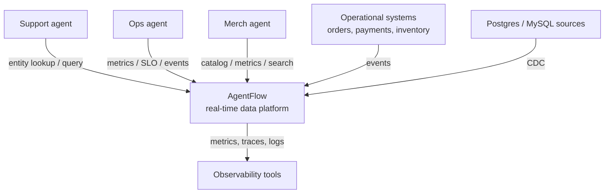
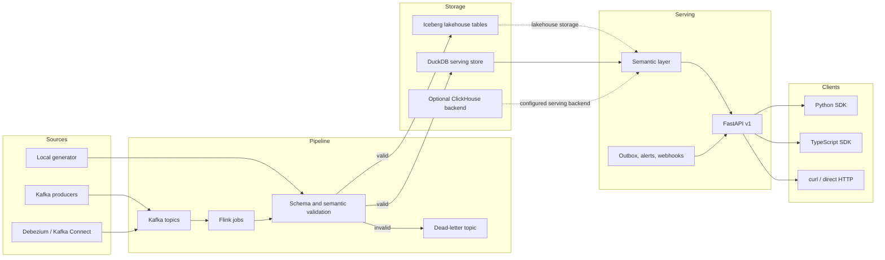
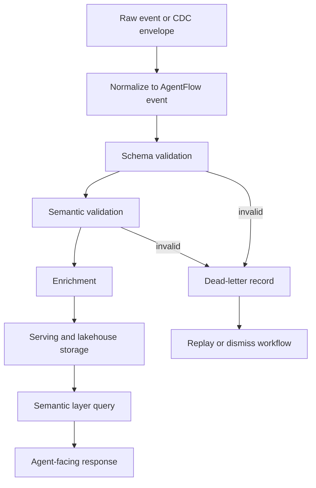
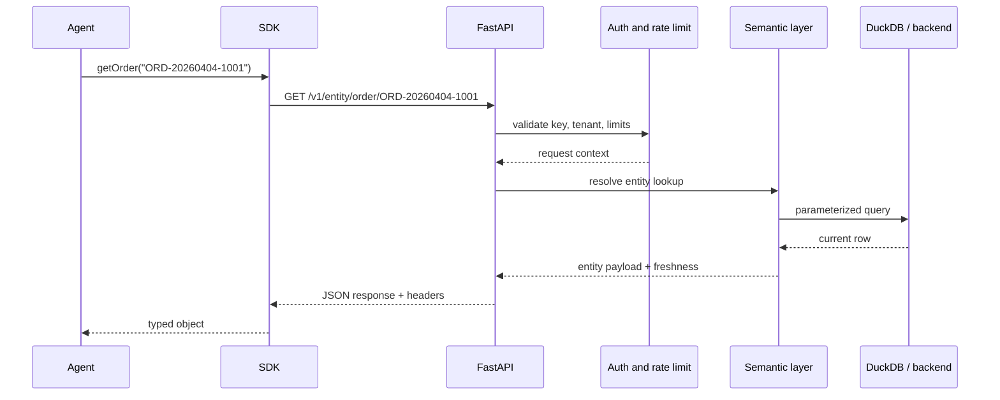
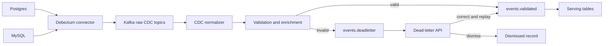

# Architecture

AgentFlow separates source capture, stream processing, storage, semantic
serving, and agent-facing clients. The local path uses the same validation and
semantic concepts as the production-shaped path, but swaps managed
infrastructure for local services and DuckDB.

## C4 level 1: system context

## C4 level 2: containers

## Runtime data flow

## Entity lookup sequence

## CDC and dead-letter flow

## Key boundaries

| Boundary | Purpose |
| --- | --- |
| Source capture | Turns application events and CDC envelopes into pipeline input |
| Validation | Prevents invalid data from becoming agent-visible state |
| Semantic layer | Gives agents entity, metric, contract, and query abstractions instead of raw tables |
| API auth | Applies API-key, tenant, entity-scope, and rate-limit checks |
| SDK contract | Keeps Python and TypeScript clients aligned with the v1 HTTP surface |
| Observability | Correlates request, pipeline, and background workflow behavior |
