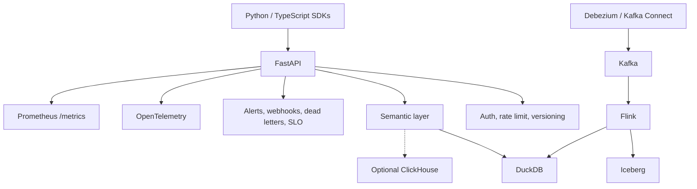

# Components

This page is a compact reference for the major components named in the
architecture.

| Component | Role in AgentFlow | Local usage | Production-shaped usage |
| --- | --- | --- | --- |
| FastAPI | Serves the v1 agent API, OpenAPI docs, health, and metrics | Uvicorn process from `make demo` | Containerized API service |
| DuckDB | Default local serving store | `agentflow_demo.duckdb` | Useful for local/test; not the only possible serving backend |
| Kafka | Event transport | Single-broker compose stack | Multi-broker production-shaped compose or managed Kafka |
| Debezium | CDC capture from source databases | Local Postgres/MySQL CDC compose path | Requires approved source ownership, secrets, and network path |
| Kafka Connect | Runs Debezium connectors | Local connector registration scripts | Kubernetes-shaped connector chart is present |
| Flink | Stream processing, validation, enrichment | Compose or local Flink workflow | Production-shaped stream jobs with checkpoints |
| Iceberg | Lakehouse table format | Local REST catalog / object-store-compatible path | Cloud object storage and catalog decided by operators |
| Dagster | Batch/orchestration layer | Development orchestration patterns | Production schedules require operator configuration |
| OpenTelemetry | Distributed tracing | Optional OTLP export to Jaeger | Exporter wiring to collector/trace backend |
| Prometheus | Metrics scraping | Scrapes `/metrics` in compose | Cluster or managed Prometheus scraping |
| Docker Compose | Local service orchestration | Demo, dev, prod-like, CDC, chaos stacks | Not a production orchestrator by itself |
| Helm | Kubernetes packaging | kind/staging rehearsals | Chart rendering and release inputs for clusters |
| Kubernetes | Runtime target | kind staging path | Operator-owned cluster environment |
| Terraform | Infrastructure reference modules | `init -backend=false` / validation evidence | Real cloud apply requires external owner setup |
| Python SDK | Typed Python client for core API surface | Editable install from `./sdk` | Published package `agentflow-client` |
| TypeScript SDK | Typed TS client for core API surface | `sdk-ts` local build/test | Published package `@yuliaedomskikh/agentflow-client` |

## Component relationships

## What is deliberately not added in Day 1

- No D2 or Structurizr build dependency.
- No Slidev deck.
- No mkdocstrings or TypeDoc generation.
- No Terraform, Helm, Kubernetes, workflow, backend, or SDK source edits.

Those are useful follow-ups once the Markdown walkthrough is stable.
