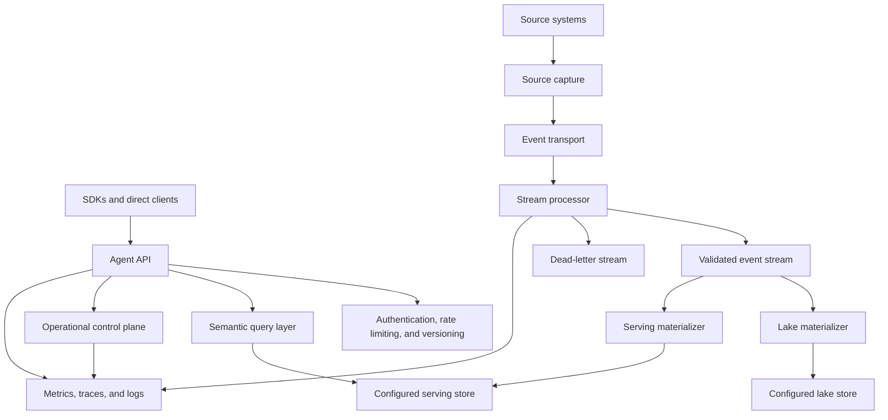

# Components

This walkthrough shows how stable responsibilities connect without pinning
them to a particular runtime stack. Use the
[detailed architecture reference](architecture.md) for current technologies,
versions, backends, and deployment topologies. Use
[engineering status](STATUS.md) for the evidence and acceptance state behind
those choices.

## Component relationships

```mermaid
flowchart TB
    clients["SDKs and direct clients"] --> api["Agent API"]
    api --> policy["Authentication, rate limiting, and versioning"]
    api --> semantic["Semantic query layer"]
    api --> control_plane["Operational control plane"]
    semantic --> serving_store["Configured serving store"]
    sources["Source systems"] --> capture["Source capture"]
    capture --> transport["Event transport"]
    transport --> processor["Stream processor"]
    processor --> validated["Validated event stream"]
    processor --> rejected["Dead-letter stream"]
    validated --> lake_materializer["Lake materializer"]
    validated --> serving_materializer["Serving materializer"]
    lake_materializer --> lake_store["Configured lake store"]
    serving_materializer --> serving_store
    api --> telemetry["Metrics, traces, and logs"]
    processor --> telemetry
    control_plane --> telemetry
```

## Follow a request

1. An SDK or direct client calls the Agent API.
2. The API applies request policy and sends analytical reads through the
   semantic query layer.
3. The query layer reads the configured serving store.
4. Operational actions enter the control plane and remain separate from
   analytical storage.

The [API walkthrough](api/index.md) shows the core request flow; the
[full API reference](api-reference.md) owns exact routes, headers, limits, and
response contracts.

## Follow an event

1. Source capture feeds an event transport.
2. The stream processor validates, enriches, and routes each event.
3. Separate materializers update the configured lake and serving stores from
   the shared validated-event boundary.
4. The request and event paths emit shared metrics, traces, and logs.

## Choose the detailed owner

| Need | Canonical owner |
| --- | --- |
| Runtime choices, versions, stores, and topology | [Detailed architecture reference](architecture.md) |
| Current acceptance evidence and external gates | [Engineering status](STATUS.md) |
| Client methods and examples | [SDK walkthrough](sdk.md) |
| Deployment-path selection | [Deployment walkthrough](deployment.md) |
| Exact operator commands | [Operational runbook](runbook.md) |
