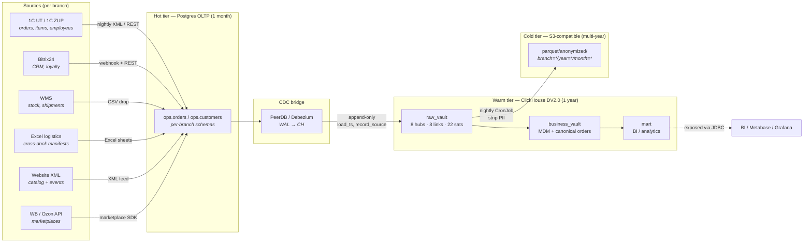

# DV2.0 Multi-Branch — End-to-End Data Flow

Companion to [`schema_dv2.md`](schema_dv2.md). The schema doc describes hubs /
links / satellites at rest; this doc describes how rows arrive there and where
they go after.

## Storyline

Mid-market e-com (clothing / footwear) with 5 locations and 3 jurisdictions:

| Branch    | Region | Jurisdiction | Role                                  |
| --------- | ------ | ------------ | ------------------------------------- |
| `msk`     | RU     | RU           | HQ + flagship store + central WMS     |
| `spb`     | RU     | RU           | Regional hub                          |
| `ekb`     | RU     | RU           | Regional hub                          |
| `dxb`     | UAE    | UAE          | Edge office + local fulfillment       |
| `ala`     | KZ     | KZ           | Edge office + local fulfillment       |

`record_source = {source_system}__{branch_code}` is load-bearing: it routes
PII to a jurisdiction-local satellite and keeps cold-tier exports per-branch
anonymizable.

## High-level flow

## Per-stage contracts

### Sources → Postgres OLTP (hot)

- **Cadence:** mixed — 1C is nightly batch (XML), Bitrix24 is webhook + hourly
  reconciliation, WMS drops CSV every 15 minutes, website pushes XML on change,
  marketplaces are pulled hourly via SDK.
- **Schema:** `ops.<branch>.<entity>` — one Postgres schema per branch keeps the
  per-jurisdiction guarantee already at ingest. Cross-branch joins live in CH,
  never in Postgres.
- **Retention:** rolling 30 days. Older data is already in ClickHouse — Postgres
  is treated as a buffer, not a system of record.

### Postgres → ClickHouse (CDC)

- **Mechanism:** logical replication via PeerDB (or Debezium if preferred) →
  `INSERT` into raw_vault tables. The CDC bridge **never updates** CH; every
  source change is a new row with a fresh `load_ts`.
- **Idempotency:** hub / link tables use `ReplacingMergeTree(load_ts)` so
  re-running a backfill collapses duplicates. Satellites are `MergeTree` with
  `(hk, load_ts)` ORDER BY — `hash_diff` lets the loader skip unchanged rows.
- **Branch routing:** the CDC writer sets `record_source =
  {source_system}__{branch}` from the Postgres schema name; nothing downstream
  guesses.

### ClickHouse — raw → business → mart

- **raw_vault** is immutable. No `UPDATE`, no `DELETE` (kept enforceable via
  RBAC). Every loader writes new rows only.
- **business_vault** resolves conflicts: e.g. `bv_customer_mdm` picks the
  canonical PII source per branch when both 1C and Bitrix have a record. SCD2
  effectivity is maintained at this layer, not the raw one.
- **mart** is the only layer BI tools see, and it is PII-free by contract
  (`customer_360` carries no contact fields). Access governance ships in
  `warehouse/agentflow/dv2/governance/` (ADR 0006 Phase 2): column-limited
  grants for analysts on the business-vault MDM views, per-jurisdiction
  PII-officer roles, and per-branch row policies on the shared
  `rv.hub_customer`.

### ClickHouse → S3 cold

- **CronJob** runs nightly (`02:00 branch-local`). For each branch it:
  1. Selects rows older than 365 days from the warm tier.
  2. Strips direct PII (`sat_customer_personal__*` is dropped; `sat_customer_anon__*`
     is exported instead — only `age_bucket`, `geo_region`, `segment`).
  3. Writes partitioned parquet:
     `parquet/anonymized/branch={branch}/year=YYYY/month=MM/*.parquet`.
- **Why anonymized:** the cold tier sits in cross-border object storage (HF
  Datasets / MinIO mock in demo). Direct PII would violate per-branch data
  sovereignty, so it stops at warm.

## Multi-branch enforcement points

| Concern                        | Where it is enforced                                       |
| ------------------------------ | ---------------------------------------------------------- |
| PII stays in jurisdiction      | Postgres schema-per-branch + per-source × per-branch sats  |
| Cross-source conflict          | `business_vault` MDM layer, not raw_vault                  |
| Cold tier de-identification    | CronJob anonymization step before S3 write                 |
| Workload pinning               | `nodeSelector: workload=clickhouse|postgres` on edge nodes |
| Audit trail per filiation      | `record_source` LowCardinality column, always populated    |

## What the demo cluster realises today

- 1 HQ cluster (`hq-demo`) with 3 kind nodes, labelled `branch=msk`.
- Postgres + ClickHouse pinned via `nodeSelector` — proving the placement
  primitive that production would use at the edge.
- Synthetic seed populates `raw_vault` with the same `40/25/15/10/10` branch
  distribution that X5 Retail Hero reproduces against real transactions.
- CDC bridge, business_vault MDM, cold-offload CronJob, and per-branch edge
  clusters (`dxb`, `ala`) are **out of scope for the demo runtime** but
  described above so the design is reproducible.
