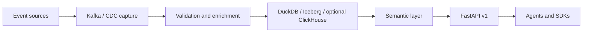

# AgentFlow Technical Walkthrough

AgentFlow is a Python/FastAPI real-time data platform for AI agents that need
fresh operational context while they are taking action. It provides a serving
boundary around live entities, typed contracts, metrics, natural-language query
translation, streaming events, and Python/TypeScript SDKs.

The walkthrough is designed for engineers who want to understand the project
before running it locally, integrating an agent, or reviewing the deployment
shape.

## What AgentFlow does

- Ingests operational events from local generators, Kafka producers, and CDC
  sources.
- Validates and enriches events before they become agent-visible state.
- Serves entities, metrics, search, lineage, contracts, and query results over a
  FastAPI v1 surface.
- Exposes typed Python and TypeScript clients for the core read/query workflow.
- Keeps local development close to the production-shaped path without requiring
  cloud credentials.

## High-level stack

| Layer | Local path | Production-shaped path |
| --- | --- | --- |
| Sources | Synthetic e-commerce events | Kafka producers, Postgres/MySQL CDC |
| Capture | Local pipeline | Debezium and Kafka Connect |
| Stream processing | Shared validation/enrichment code | Flink jobs over Kafka topics |
| Storage | DuckDB, local Iceberg catalog | Iceberg/object storage; optional ClickHouse serving backend |
| Serving | FastAPI on `localhost:8000` | Containerized API behind an operator-owned edge |
| Clients | curl, Python SDK, TypeScript SDK | Agent runtimes and service integrations |
| Observability | `/metrics`, logs, optional Jaeger/Grafana compose | Prometheus, OpenTelemetry, structured logs |

## Documentation map

- Start with [Quickstart](quickstart.md) to run the local API and make the first
  requests.
- Read [Architecture](architecture/index.md) for C4 context, container view, and
  runtime data-flow diagrams.
- Use [API](api/index.md) and [SDKs](sdk.md) when wiring an agent or application.
- Use [Deployment](deployment.md), [Observability](observability.md), and
  [Troubleshooting](troubleshooting.md) for operator-oriented workflows.

## Status and out of scope

!!! note "Current evidence boundary"
    The repository contains local evidence for tests, linting, SDK checks,
    contract checks, and security baseline work in the release-readiness
    documents. This walkthrough does not replace those evidence files, and a
    docs-only branch should still rerun the relevant local gates before it is
    treated as release evidence.

!!! warning "Claims not made here"
    This site does not claim that AWS OIDC-backed Terraform apply has run, that
    a third-party penetration test has been completed, that object-lock-backed
    immutable audit retention is active, or that formal compliance certification
    has been obtained. Those are external gates and require owner-supplied
    evidence outside this Day 1 docs build.

## Existing evidence and deeper references

- [Release readiness](https://github.com/brownjuly2003-code/agentflow/blob/main/docs/release-readiness.md)
  tracks current local and external gate status.
- [Security audit](https://github.com/brownjuly2003-code/agentflow/blob/main/docs/security-audit.md)
  explains application-layer controls and remaining external evidence gaps.
- [Operational runbook](https://github.com/brownjuly2003-code/agentflow/blob/main/docs/runbook.md)
  covers incident and maintenance procedures.
- [API reference](https://github.com/brownjuly2003-code/agentflow/blob/main/docs/api-reference.md)
  remains the detailed endpoint-by-endpoint reference.
