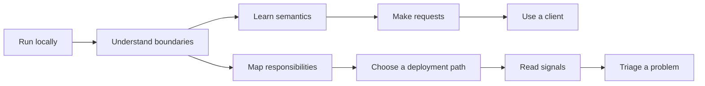

# AgentFlow Technical Walkthrough

AgentFlow turns operational events into current entities, metrics, and
queryable context behind one integration boundary. This site is a curated
learning path for engineers who want to run the project, understand its
responsibility boundaries, or integrate a client.

Use the [project overview](https://github.com/brownjuly2003-code/agentflow/blob/main/README.md)
for product scope and the release story, the
[detailed architecture reference](architecture.md) for current runtime choices
and topology, and [engineering status](STATUS.md) for current evidence and
gates. The [documentation hub](https://github.com/brownjuly2003-code/agentflow/blob/main/docs/README.md)
maps the complete corpus and its historical records.

## Choose a path

| Goal | Start here | Continue with |
| --- | --- | --- |
| Run the local walkthrough | [Quickstart](quickstart.md) | [API](api/index.md) or [SDKs](sdk.md) |
| Understand the system | [Architecture](architecture/index.md) | [Concepts](concepts.md) and [Components](components.md) |
| Prepare an environment | [Deployment](deployment.md) | [Observability](observability.md) |
| Triage a local problem | [Troubleshooting](troubleshooting.md) | [Operational runbook](runbook.md) |

## Learning sequence

```mermaid
flowchart LR
    quickstart["Run locally"] --> architecture["Understand boundaries"]
    architecture --> concepts["Learn semantics"]
    architecture --> components["Map responsibilities"]
    concepts --> api["Make requests"]
    api --> sdk["Use a client"]
    components --> deployment["Choose a deployment path"]
    deployment --> observability["Read signals"]
    observability --> troubleshooting["Triage a problem"]
```

## Source ownership

| Question | Canonical owner |
| --- | --- |
| What the project offers and why | [Project overview](https://github.com/brownjuly2003-code/agentflow/blob/main/README.md) |
| Which runtime, version, backend, or topology is current | [Detailed architecture reference](architecture.md) |
| Which HTTP routes, headers, limits, and fields exist | [Full API reference](api-reference.md) |
| What is proven, blocked, or externally gated now | [Engineering status](STATUS.md) |
| Where current, historical, and generated documents belong | [Documentation hub](https://github.com/brownjuly2003-code/agentflow/blob/main/docs/README.md) |

Walkthrough pages own the learning sequence and stable explanations. When an
exact inventory or current claim changes, its linked reference remains the
source of truth.
