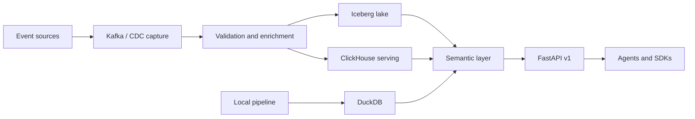

# AgentFlow Technical Walkthrough

AgentFlow is a Python/FastAPI real-time data platform that serves fresh
operational context to people, dashboards, services, and AI agents. It provides
a serving boundary around live entities, typed contracts, metrics,
natural-language query translation, streaming events, and Python/TypeScript
SDKs. Agents are one consumer of the platform, not a separate product line.

The walkthrough is designed for engineers who want to understand the project
before running it locally, integrating an agent, or reviewing the deployment
shape.

## What AgentFlow does

- Ingests operational events from local generators, Kafka producers, and CDC
  sources.
- Validates and enriches events before they become agent-visible state.
- Serves entities, metrics, search, lineage, contracts, and query results over a
  FastAPI v1 surface.
- Exposes typed Python and TypeScript clients for the core read/query workflow.
- Keeps local development close to the production-shaped path without requiring
  cloud credentials.

## High-level stack

| Layer | Local path | Production-shaped path |
| --- | --- | --- |
| Sources | Synthetic e-commerce events | Kafka producers, Postgres/MySQL CDC |
| Capture | Local pipeline | Debezium and Kafka Connect |
| Stream processing | In-process validation/enrichment | PyFlink jobs over Kafka topics |
| Storage | DuckDB | Iceberg lake evidence plus ClickHouse serving |
| Serving | FastAPI on `localhost:8000` | Containerized API behind an operator-owned edge |
| Clients | curl, Python SDK, TypeScript SDK | Agent runtimes and service integrations |
| Observability | `/metrics`, logs, optional Jaeger/Grafana compose | Prometheus, OpenTelemetry, structured logs |

```mermaid
flowchart LR
    sources["Event sources"] --> capture["Kafka / CDC capture"]
    capture --> processing["Validation and enrichment"]
    processing --> lake["Iceberg lake"]
    processing --> serving["ClickHouse serving"]
    local["Local pipeline"] --> duckdb["DuckDB"]
    lake --> semantic["Semantic layer"]
    serving --> semantic
    duckdb --> semantic
    semantic --> api["FastAPI v1"]
    api --> clients["Agents and SDKs"]
```

## Documentation map

- Use the [complete documentation hub](https://github.com/brownjuly2003-code/agentflow/blob/main/docs/README.md)
  to navigate current references, operations, evidence, decisions, and archive.
- Start with [Quickstart](quickstart.md) to run the local API and make the first
  requests.
- Read [Architecture](architecture/index.md) for C4 context, container view, and
  runtime data-flow diagrams.
- Use [API](api/index.md) and [SDKs](sdk.md) when wiring an agent or application.
- Use [Deployment](deployment.md), [Observability](observability.md), and
  [Troubleshooting](troubleshooting.md) for operator-oriented workflows.

## Status and out of scope

!!! note "Current evidence boundary"
    The real streaming path, live Iceberg boundary, checkpoint restore/replay,
    and digest-only staging promotion have bounded PASS evidence. Production
    rollout is not implemented or authorized, and the project remains a
    production candidate. This walkthrough never replaces the linked evidence.

!!! warning "Claims not made here"
    This site does not claim that AWS OIDC-backed Terraform apply has run, that
    a third-party penetration test has been completed, that object-lock-backed
    immutable audit retention is active, or that formal compliance certification
    has been obtained. Those are external gates and require owner-supplied
    evidence outside this documentation build.

## Existing evidence and deeper references

- [Engineering status](https://github.com/brownjuly2003-code/agentflow/blob/main/docs/STATUS.md)
  tracks current PASS, blocked, and external gates.
- [Release readiness](https://github.com/brownjuly2003-code/agentflow/blob/main/docs/release-readiness.md)
  tracks the unpublished release line and supply-chain boundary.
- [Security audit](https://github.com/brownjuly2003-code/agentflow/blob/main/docs/security-audit.md)
  explains application-layer controls and remaining external evidence gaps.
- [Operational runbook](https://github.com/brownjuly2003-code/agentflow/blob/main/docs/runbook.md)
  covers incident and maintenance procedures.
- [API reference](https://github.com/brownjuly2003-code/agentflow/blob/main/docs/api-reference.md)
  remains the detailed endpoint-by-endpoint reference.
