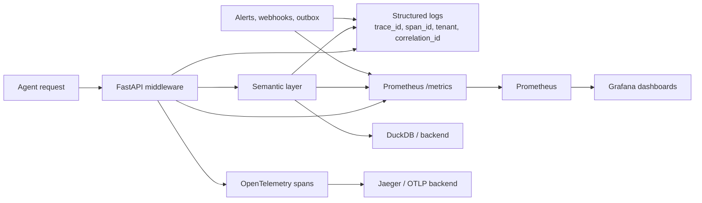

# Observability

AgentFlow exposes metrics, traces, logs, and operational API routes so agents
and operators can understand freshness, latency, errors, and pipeline health.

## Observability flow



## Metrics

The API exposes Prometheus metrics at:

```bash
curl http://localhost:8000/metrics
```

The compose stacks include Prometheus and Grafana wiring for local inspection.
Metrics are useful for:

- request volume
- latency distribution
- error rates
- cache behavior
- background workflow health
- pipeline status signals

## Traces

OpenTelemetry instrumentation can export FastAPI and HTTP client spans to an
OTLP collector such as Jaeger. In the production-shaped compose stack, Jaeger is
available on `http://127.0.0.1:16686`.

Useful environment variables:

```bash
OTEL_EXPORTER_OTLP_ENDPOINT=http://jaeger:4317
OTEL_SERVICE_NAME=agentflow-api
```

## Logs

Structured logs include correlation fields so a single request can be followed
across middleware, semantic-layer work, and background components. When a client
sends `X-Correlation-ID` or `X-Request-Id`, the API returns an
`X-Correlation-ID` response header.

## SLO and performance evidence

The checked-in benchmark baseline records sub-second local entity and query
behavior for the measured environment. The release-readiness document tracks
the current evidence table and known caveats.

Treat benchmark numbers as measured evidence, not universal guarantees. Actual
latency depends on data volume, hardware, backend choice, cache behavior, and
network path.

Representative baseline shape:

| Endpoint family | Evidence use |
| --- | --- |
| Entity lookup | p50/p99 latency and failure-rate tracking |
| Metrics | cache and backend latency checks |
| Natural-language query | translation, SQL guard, and execution latency |
| Batch | aggregate multi-call behavior |

## Operational routes

| Route | Use |
| --- | --- |
| `/v1/health` | Health checks and readiness-style inspection |
| `/metrics` | Prometheus scrape |
| `/v1/slo` | SLO compliance and error-budget view |
| `/v1/deadletter` | Failed event investigation and replay |
| `/v1/alerts` | Alert rule and history workflow |
| `/v1/webhooks` | Webhook registration, test delivery, and logs |

## Caveats

- Local metrics are not a substitute for production monitoring ownership.
- Jaeger/Grafana compose wiring helps debugging, but it is not evidence of a
  managed production telemetry stack.
- External audit retention requires separate storage-policy evidence before it
  can be described as immutable.
