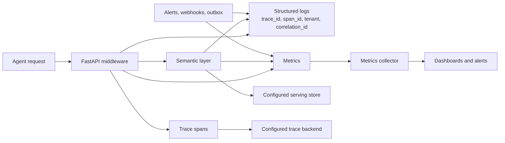

# Observability

This walkthrough shows how AgentFlow combines metrics, traces, and logs to
explain freshness, latency, errors, and pipeline health. Use the
[operational runbook](runbook.md) for exact inspection commands, telemetry
configuration, and retention work; the
[full API reference](api-reference.md) for operational route contracts; and
[engineering status](STATUS.md) for current evidence and acceptance gates.
The [detailed architecture reference](architecture.md) owns the runtime
topology behind these signals.

## Observability flow

```mermaid
flowchart LR
    request["Agent request"] --> api["FastAPI middleware"]
    api --> logs["Structured logs\ntrace_id, span_id, tenant, correlation_id"]
    api --> metrics["Metrics"]
    api --> traces["Trace spans"]
    api --> semantic["Semantic layer"]
    semantic --> store["Configured serving store"]
    semantic --> logs
    semantic --> metrics
    background["Alerts, webhooks, outbox"] --> logs
    background --> metrics
    traces --> trace_backend["Configured trace backend"]
    metrics --> collector["Metrics collector"]
    collector --> dashboards["Dashboards and alerts"]
```

## Metrics

Metrics show what changed across the request path and background workflows.
Use them to inspect:

- request volume
- latency distribution
- error rates
- cache behavior
- background workflow health
- pipeline status signals

The runbook owns the current scrape command and local dashboard entrypoints.

## Traces

Trace spans connect API work, HTTP calls, semantic-layer processing, and
background activity. Follow a trace when an aggregate metric identifies a
slow or failing path; use the runbook for the supported exporter and disable
settings.

## Logs

Structured logs carry correlation context so a single request can be followed
across middleware, semantic-layer work, and background components. The API
reference owns the exact request and response header contract.

## Reading signals together

- Start with metrics to identify the affected time window and component.
- Use a trace to locate the slow or failing span within that window.
- Correlate structured logs to the request and tenant context.
- Compare pipeline freshness with request latency before deciding whether the
  fault is ingestion, processing, serving, or the client path.

## Evidence boundary

Benchmarks are point-in-time evidence, not universal guarantees. Actual
latency depends on data volume, hardware, backend choice, cache behavior, and
network path. Engineering status records which evidence is current and which
production gates remain open.

## Caveats

- Local metrics are not a substitute for production monitoring ownership.
- Local dashboard and trace-backend wiring helps debugging, but it is not
  evidence of a managed production telemetry stack.
- External audit retention requires separate storage-policy evidence before it
  can be described as immutable.
